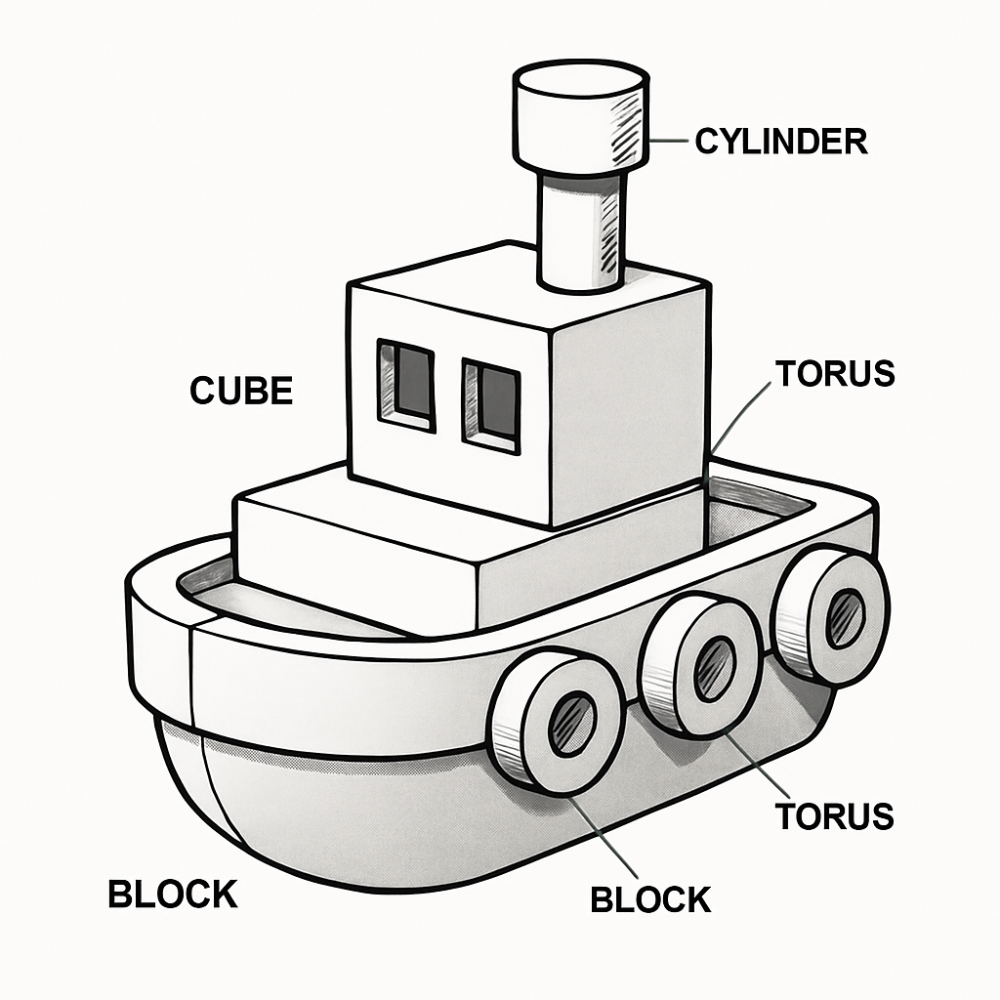

# DreamFast

Fast AI generated text‑to‑3D previews. Type a scene description and get quick 3D object previews built from simple primitives. Great for blocking ideas and iterating on shape and composition before heavy rendering.

<p align="center">

<span style="display:inline-block; margin: 0 10px; font-size: 28px; vertical-align: middle;">→</span>

<span style="display:inline-block; margin: 0 10px; font-size: 28px; vertical-align: middle;">→</span>

  
</p>

## Highlights
- Instant feedback: each object preview appears in a 3D interactive viewer.
- Simple building blocks: uses only simple shapes for speed and reliability.
- Saves sketch files for reuse.

## Requirements
- Python 3.10+
- OpenAI API key

## Setup
1) Install Python
- Windows/macOS/Linux: https://www.python.org/downloads/

2) Install dependencies (from the repo root)
- `python -m pip install -r requirements.txt`

3) Configure OpenAI
- Create a key at https://platform.openai.com/
- Set it in the `.env` file.
  - Example `.env`:
    - `OPENAI_API_KEY=sk-...`

## Quick Start
Run the app:

```
python dreamfast.py
```

Then type a short prompt, for example:

```
prompt> a small tugboat floating at sunset
```

What happens:
- Objects are extracted from your text via AI.
- Each object is "sketched" into a few primitives and previewed in the viewer.

Commands:
- `verbose on|off` — toggle/show AI prompt used.
- `timings on|off` — show stage timings.
- `reality 0..100` — set/show detail budget (0 = placeholder box; default 5).

## Configuration
- `OPENAI_API_KEY` — required for planning from text.
- `RENDER_BACKEND` — `python` (default).
- `REALITY_FACTOR` — controls part/detail budget (maps to max parts). Default 5.
- `KITBASH_MAX_PARTS` — hard cap on parts (overrides reality factor).
- `KITBASH_PROMPT` — choose a prompt variant from `prompts/aiprompts.json`.

Files:
- `sketches/*.json` — per‑object sketches you can reuse.

You can preview any sketch with a separate viewer, for example:
- From repo root: `python tests/manual_3dviewer_test.py --json tests/tugboat_kitbash.json`

## How It Works (High Level)
- Pipeline: Prompt → Object extraction → sketch into primitives → Normalize → Preview/Render.
- Schema: `src/planner/structured_plan.py` defines safe primitives and transforms.

## Prompt Variants (Advanced)
Prompt variants live in `prompts/aiprompts.json`.
- Choose the default with the top‑level `default` key (e.g., `improved_codex2`).

## Limitations
- No textures, but objects can have one color (e.g., a red apple).
- Lighting kept simple for speed and stability.

## License
MIT — see `LICENSE`.
